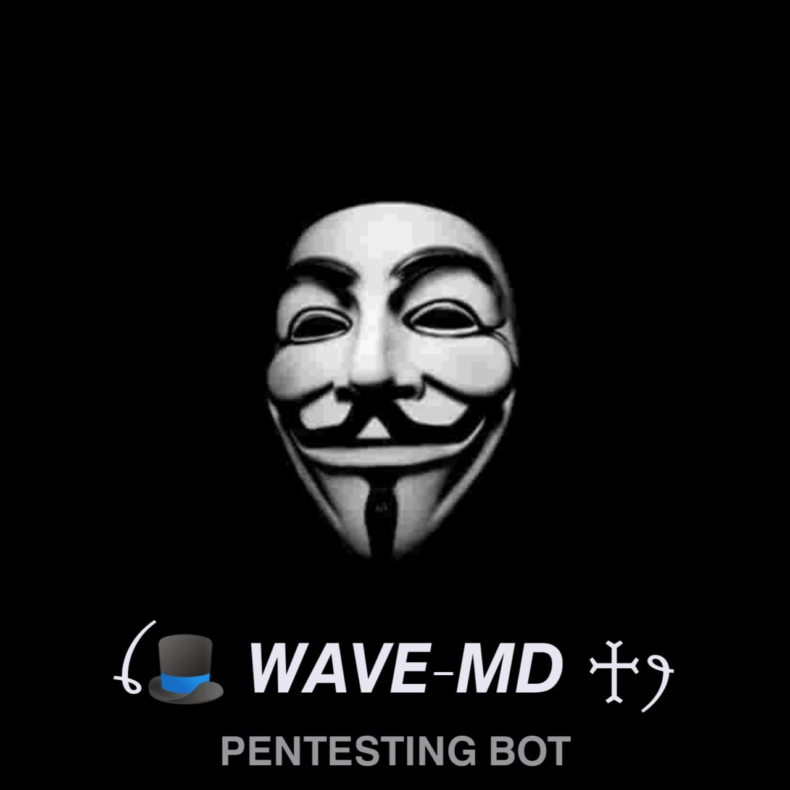

<a href="https://bealthguy.netlify.app"></a>
<h1 align="center">WAVE-MD<br></h1>

<p align="center"> 
  Whatsapp bot made by nodejs
</p>


</br>

### This bot is still under development so if you want to recode/modify it, pls check this main repo once in 3 days because i am continuously debugging it and making major changes in it.
</br>

### SETUP WAVE-MD 

  
 Fork The Repo
    <br>
    <a href="https://github.com/Kyle6012/WAVE-MD/fork"></a>


# Install Manually 
<details>
  
## Requirements

* [Node.js](https://nodejs.org/en/)
* [Git](https://git-scm.com/downloads)
* [FFmpeg](https://github.com/BtbN/FFmpeg-Builds/releases/download/autobuild-2020-12-08-13-03/ffmpeg-n4.3.1-26-gca55240b8c-win64-gpl-4.3.zip)
* [Libwebp](https://developers.google.com/speed/webp/download)
* Any text editor

<br>

- Termux
```js
apt update -y && apt upgrade -y && pkg update -y && pkg upgrade -y && pkg install libwebp -y && pkg install git -y && pkg install nodejs -y && pkg install ffmpeg -y && pkg install yarn && pkg install imagemagick -y && git clone https://github.com/MariaWaBot/WAVE-MD && cd WAVE-MD && npm install && npm start

```

- Update
```js
rm -rf WAVE-MD &&
git clone https://github.com/Kyle6012/WAVE-MD && cd WAVE-MD && npm install && npm start

```

- Command For 24/7
```js
npm i -g forever && forever index.js && forever save && forever logs
```
<br>

</details>


Feel free to contribute and make this project even better.
